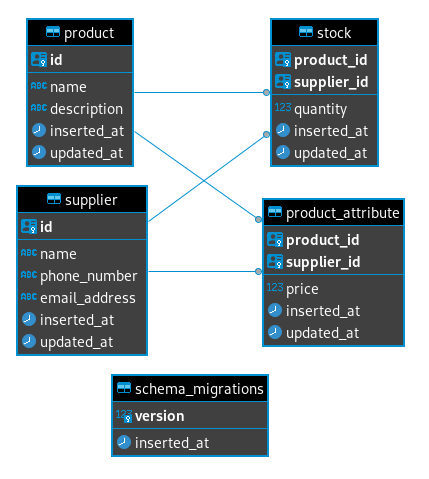

# Stocked

A sample application to test out [Phoenix LiveView](https://hexdocs.pm/phoenix_live_view/Phoenix.LiveView.html).

To start the Phoenix server:

  * Install dependencies with `mix deps.get`
  * Move `.envrc.example` to `.envrc` and set the variables
  * [Optional] Start Postgres with `docker/docker-compose.yml` (if you don't already have Postgres locally installed)
  * Create and migrate your database with `mix ecto.setup`
  * Install Node.js dependencies with `npm install` inside the `assets` directory
  * Start Phoenix endpoint with `mix phx.server`

Now you can visit [`localhost:4000`](http://localhost:4000) from your browser.

## Data Model

A very simple data model is used which looks like the following.

